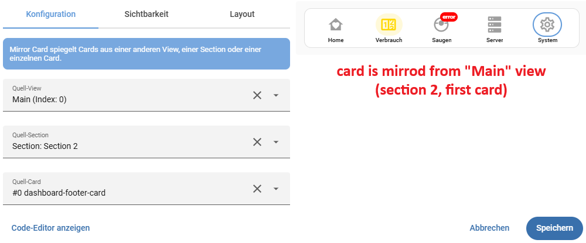

# Mirror Card

A card that clones/mirrors cards from other dashboard views. Supports three nesting levels: entire view, section, or individual card.

[](https://github.com/hacs/integration)
[](https://github.com/thecodingdad/mirror-card/releases)

## Screenshot



## Features

- Three mirroring modes:
  - **View-only:** Mirror all cards from a view
  - **View + Section:** Mirror all cards from a specific section
  - **View + Section + Card:** Mirror a single specific card
- Layout preservation (native) or override (stack/grid)
- Source resolution by view index or path
- Dynamic card creation and rendering
- EN/DE multilanguage support

## Prerequisites

- Home Assistant 2026.3.0 or newer
- HACS (recommended for installation)

## Installation

### HACS (Recommended)

1. Open HACS in your Home Assistant instance
2. Go to **Frontend**
3. Click "Explore & Download Repositories"
4. Search for "Mirror Card"
5. Click "Download"
6. Reload your browser / clear cache

### Manual Installation

1. Download the latest release from [GitHub Releases](https://github.com/thecodingdad/mirror-card/releases)
2. Copy the `dist/` contents to `config/www/community/mirror-card/`
3. Add the resource in **Settings** → **Dashboards** → **Resources**:
   - URL: `/local/community/mirror-card/mirror-card.js`
   - Type: JavaScript Module
4. Reload your browser

## Usage

### Mirror an entire view

```yaml
type: custom:mirror-card
source_view: 2
```

### Mirror a specific section

```yaml
type: custom:mirror-card
source_view: overview
source_section: 1
```

### Mirror a specific card

```yaml
type: custom:mirror-card
source_view: overview
source_section: 1
source_card: 0
layout: native
```

## Configuration

### Card Options

| Option | Type | Default | Description |
|--------|------|---------|-------------|
| `source_view` | number/string | required | Source view index (number) or path (string) |
| `source_section` | number | — | Section index within the view |
| `source_card` | number | — | Card index within the section |
| `layout` | string | native | Layout mode: `native`, `stack`, or `grid` |

## Multilanguage Support

This card supports English and German.

## License

This project is licensed under the MIT License - see the [LICENSE](LICENSE) file for details.
